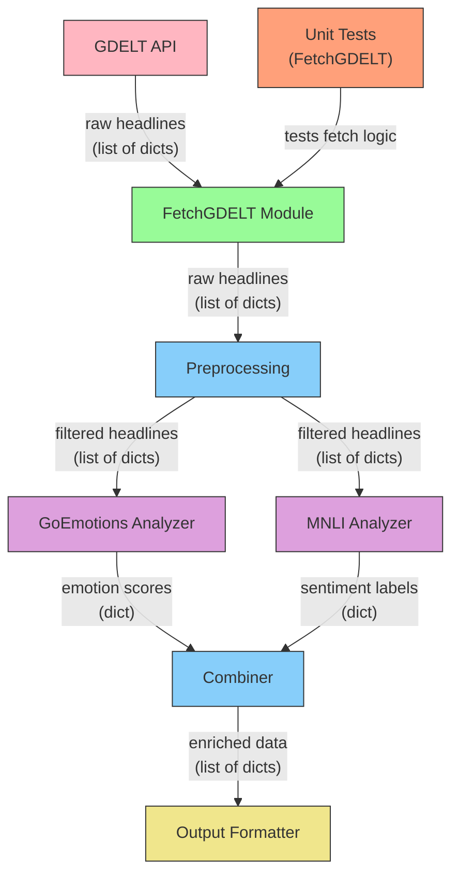

# Resonance: 뉴스 감정 분석

## 개요

GDELT(Global Database of Events, Language, and Tone)에서 뉴스 헤드라인을 수집하여 감정 분석을 수행합니다. 여러 감정 분석 방식을 결합하여 뉴스 헤드라인의 정확한 감정 분류를 제공합니다.

- 감정 분류 + NLI를 결합한 접근 방식을 사용하여 더 정확한 감정 분석
- 여러 국가와 시간 범위에 대한 뉴스 수집 (GDELT)
- 감정 예측에 대한 신뢰도 점수 시스템

<br>

## 구조



<br>

## 감정 분석 프로세스

1. GDELT에서 뉴스 헤드라인 수집
   - 수집 국가 : 미국, 영국, 한국, 북한, 일본, 중국, 독일, 프랑스, 러시아, 인도, 브라질
2. 두 가지 감정 분석 방식 적용:
   - RoBERTa 기반 GoEmotions 모델 (27가지 감정 분류)
   - BART 기반 MNLI 모델 (감정 분류)
3. 두 방식의 결과를 가중치를 적용하여 결합
4. 최종 감정 레이블과 신뢰도 점수 산출

<br>

## 구성

### 1. fetch_gdelt.py

**입력값:**

- timespan: 뉴스 수집 시간 범위 (기본값: "1hours")
- num_records: 수집할 레코드 수 (기본값: 250)
- countries: 뉴스 필터링을 위한 국가 코드 목록

**출력값:**

- 다음 정보를 포함하는 딕셔너리 리스트:
  - url: 뉴스 기사 URL
  - source_country: 뉴스 출처 국가 코드
  - headline: 뉴스 헤드라인 텍스트
  - date: 발행일

**주요 기능:**

- GDELT에서 뉴스 기사 수집
- 영어 콘텐츠 필터링
- 중복 제거
- 15자 미만 헤드라인 필터링

<br>

### 2. news2emotion.py

**입력값:**

- 헤드라인, 타임스탬프, 출처 국가를 포함하는 뉴스 기사 딕셔너리

**출력값:**

- 다음 정보를 포함하는 딕셔너리:
  - headline: 원본 헤드라인
  - timestamp: 타임스탬프 (UTC)
  - sourcecountry: 출처 국가 코드
  - sentiment: 레이블과 신뢰도 점수를 포함하는 딕셔너리
- 결과는 JSON 파일로 저장됨 (news_sentiment_YYYYMMDD_HHMMSS.json)

**주요 함수:**

- `fetch_latest()`: 최신 뉴스를 가져오는 함수
- `sentiment_score()`: 감정 확률에서 감정 점수 계산
- `headline_emotion()`: 헤드라인을 처리하고 감정 분석 결과를 반환하는 메인 함수

<br>

### 3. sentiment_nli.py

**입력값:**

- text: 뉴스 헤드라인 텍스트

**출력값:**

- 다음 정보를 포함하는 튜플:
  - label: 감정 레이블 (긍정/부정/중립)
  - confidence: 신뢰도 점수
  - scores: 각 감정에 대한 점수 딕셔너리

**주요 기능:**

- Facebook의 BART-large-mnli 모델을 사용한 분류
- 긍정/부정/중립 감정 분류 및 신뢰도 점수 계산

<br>

## JSON 결과 예

```json
[
  {
    "headline": "Global Tech Summit Announces Revolutionary AI Breakthrough",
    "timestamp": "2024-03-21 10:30 UTC",
    "sourcecountry": "US",
    "sentiment": {
      "label": "positive",
      "confidence": 0.85
    }
  },
  {
    "headline": "International Climate Conference Reaches Historic Agreement",
    "timestamp": "2024-03-21 11:15 UTC",
    "sourcecountry": "FR",
    "sentiment": {
      "label": "positive",
      "confidence": 0.92
    }
  },
  {
    "headline": "Economic Uncertainty Rises as Global Markets Fluctuate",
    "timestamp": "2024-03-21 12:00 UTC",
    "sourcecountry": "UK",
    "sentiment": {
      "label": "negative",
      "confidence": 0.78
    }
  }
]
```

<br>
